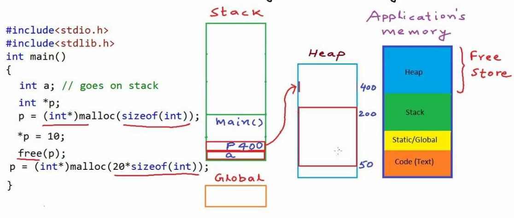

### Dynamic Memory allocation in C

## Memory structure of a program


## Stack
Every application is allocated a Stack space for execution of functions. All functions are given their own space called **stackframes**. Scope of a local variable declared inside the function only exist inside the stackframe of that function.

Stacks have fixed memory and it can not be changed during execution of program. If there is insufficient stack memory then program will fail with an error **stack overflow**

## Global
Global contains all the static and global variables. It gets purged at the end of program execution.

## Heap
Heap is used for allocating large chunk of memory or keeping variables in the memory as long as we want. Unlike stack, heap is not assigned a fixed memory during lifetime of application.

There is no set rule for allocation or deallocation of heap memory so programmer must ensure that they deallocate the memory which has no further use. Heaps can grow as long as the system's memory allows.

**This Heap memory has no simmilarity with Heap datastructure**

## Functions for dynamic memory allocation deallocation

**In C**
-----------

## malloc
Malloc assigns a contiguous space in the heap for asked size and of asked type. It returns void* so in case of specific needs one must typecast it to the requirement.
```
int* p = (int*) malloc(3*sizeof(int)); 	//assigns 3 blocks of int size memory
```

malloc does not initialize the memory blocks with any value so intially they have garbage value.

## calloc
Calloc works like malloc but it also assigns 0 to all the initialize blocks. It takes two parameters size and size_t
```
int* p = (int*) calloc(n, sizeof(int)); 	//assigns 3 blocks of int size memory
```
According to the standard, calloc does not store 0, but sets all bits zero. This does not necessarily result in a float 0.0 or a null pointer constant, as they might have other binary representations. For integer types, however, 0 has all bits zero, so this works.

**To set structured values (some constant c) of an allocated array, there is no way around using a loop**

## realloc
Realloc is used in case you want to increase or decrease the already allocated memory block. It takes two variables pointer to the memory block you want to change size for and n*size_t. n being the new size.
```
int* p = (int*) realloc(A, n*sizeof(int)); 	//increases or decreases size of memory depending on n and size of A
```

realloc can use contiguous or consecutive memory block if available. If there is no such memory is available then it copies over all the data from old block to new block of new size n.

## free
As we read earlier Heap does not deallocates the memory blocks assigned during the lifetime of applicaiton, so me must specifically free the space by using **free**

```
free(p);		//Will deallocate p 
```

**In C++**
-----------
In C++ we use **new** and **delete** for allocation and deallocation of memory.
```
int *p = new int[20];    //will assign a memory block of size 20 integer array
delete p;               //will deallocate the memory block and free the memory
```

## Memory Leak
When we assign some heap memory during the execution of the program and ignore or forget to deallocate/free it. It causes memory leak in Heap memory. As that memory block is abondoned into Heap without any further use. 
