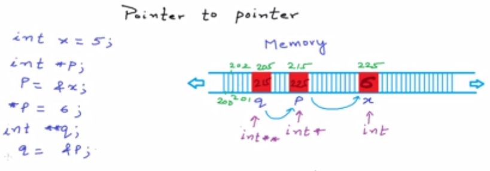
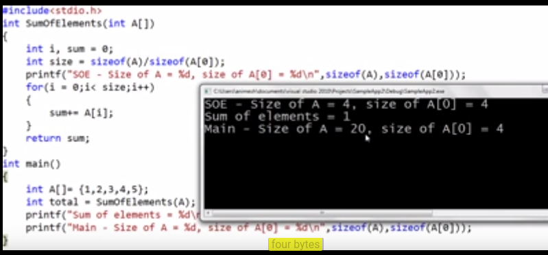

# Pointer in C
--------------
Pointers are **strongly typed** meaning if you want to assign address of an integer to a pointer then you have to declare
int* for your pointer simillarly for char/double etc.

In case you assign a char* to a int* like
```
int a = 1025;
int* p = &a;
char *p1 = p;
```

then print *p1 would fetch the value of first byte from the 4 byte integer because char is of size 1 byte.
so any arithmatic like *p1 + 1 would denote next byte from integer's value.

Best resource to refresh pointers would be to watch [video series](https://www.youtube.com/playlist?list=PL2_aWCzGMAwLZp6LMUKI3cc7pgGsasm2_)

## Pointer to Pointer
---------------------


## Pointers as function argument

Essentially when we set an argument as 
```
function foo(int* p) {}
```

We are saying that this function needs to be passed with a **&arg** because int* is also a representation to &a if a was an intger.

## Arrays and Pointer

Arrays are very simmilar to the concept of pointers. for example

```
int arr[] = {1,2,3,4,5};
printf("%d\n", arr);
printf("%d\n", &arr[0]);
printf("%d\n", arr[1]);
printf("%d\n", *(arr+1));
```

Here first two lines would print the same value which is address of the array.
Last two lines will print the value of next element i.e. **2** 
So what this means is that when we say arr[1] it also means *(arr+1) 
so lets take an example of reverting an array, we would need to swap left and right elements with each other
so the code would be as below

```
//Returns pointer to the new array
int* reverse() {
  int arr[] = {1, 2, 3, 4, 5};
  int start = 0, length = 5; //just because length is static for the example
  
  while(start < length) {
    swap(arr[start++], arr[--length]);  //Passing array elements without using &
  }
  
  return arr;
}

//Swap function using XOR for swapping
void swap(int *a, int *b) {
  *a = *a ^ *b;
  *b = *a ^ *b;
  *a = *a ^ *b;
}
```
Did you notice how I could simply pass array elements withou using & in the swap function. This is only possible because arrays are pass by reference not pass by value.

## Array as function argument

Its very common to pass an array as a function argument. Given arrays can be of huge size whenever we pass an array as argument to any funtion its a **Pass by reference** so the function will create a new variable in its stack and reffer to the original array. Look at the below snippet for an interesting observation.



Did you see how size of array in function says its just one while in main method it's 5. The reason for this is array is being Passed by reference due to which the function argument is just an integer pointer to the actual array. So its size is equal to integer byte size.

Here is a detailed image explaining this.


## Fucntion Pointers

Pointers --> can also point to a function.

If we understand how a particular program gets converted into machine language then we would see that all code is converted into instructions for machine. So generally instructions for a program is executed sequentially unless any instruction itself sends it to some particular address like a function call. **In memory block code stores these instructions**

```
int Add(int a, int b){
	return a+b;
}

void printHello() {
	cout << "hello world!\n";
}

int main() {
	//Pointer to function that should take (int, int) as argument/parameter and return int
	int (*p)(int,int);	//Paranthesis are important otherwise it would be function declaration returning a int*
				//type of p should always be return type of function
	
	p = &Add; or p = Add;	//Now p points to function Add
	c = (*p)(2,3); or c = p(2,3);	//derefrencing and executing the function

	cout << c;		//5
	
	void (*k)();
	k = printHello;
	k();			//Will print hello world!

	return 0;
}
```

## Function callbacks

All the usecases of **function pointers** is that functions can be passed as argument to other functions. Then a function which will recieve a function pointer as argument can **callback** that function that this pointer will point to.

```
void A() {
	cout << "Hello\n";
}

void B(void (*p)()) {			//Function pointer as argument
   p();
}
int main() {
	void (*p)() = A;		//We can directly pass A without declaring it as well
	B(A);				//B Will callback on A and print hello
}
```


 

